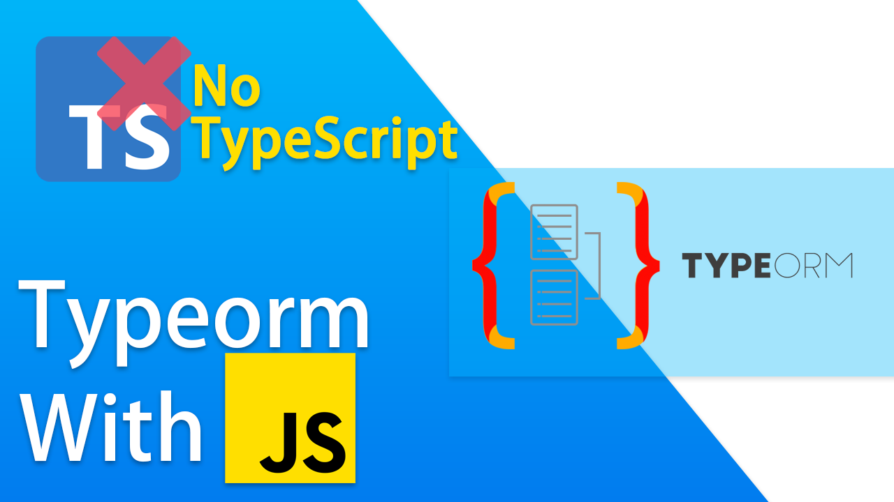

<h1 style="text-align: center">TypeOrm With JS<br> (No TypeScript)</h1>

  <!--[](https://opencollective.com/nest#backer)
  [](https://opencollective.com/nest#sponsor)-->

##  Install Dependencies

```bash
$ npm install
```

## Run Project ( Port is 3000)

```bash
$ npm run dev
```


# Support By Subscribing [Notezz](https://www.youtube.com/channel/UC8DETz-dfBr_xkotFcNu5tQ).

## Stay in touch

- Author - Afaq Javed
- Website - [https://afaqjaved.com]